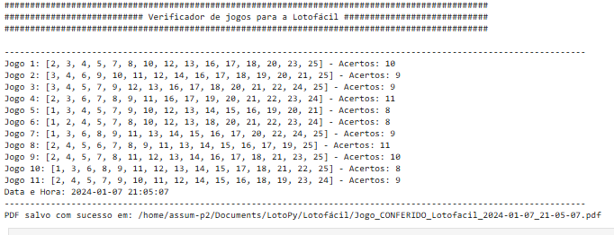

# Lotofácil Lottery Checker 🎱

A Python script that allows you to check multiple Lotofácil (Brazilian lottery) games against drawn numbers, generating PDF reports of the results.

## 📋 Features

- Check multiple Lotofácil games through a CSV file
- Automatic hit counting for each game
- PDF report generation with results
- Error handling for invalid inputs
- Detailed documentation of results with date and time

## 🔧 Prerequisites

To run this script, you need to have installed:

- Python 3.6 or higher
- ReportLab library for PDF generation

## 📦 Installation

1. Clone this repository:
```bash
git clone https://github.com/your-username/lotofacil-checker.git
cd lotofacil-checker
```

2. Install the required dependencies:
```bash
pip install reportlab
```

## 🎮 How to Use

1. Prepare your CSV file with Lotofácil games:
   - Each line should contain 15 numbers
   - Numbers must be separated by commas
   - Format example:
     ```
     1,2,3,4,5,6,7,8,9,10,11,12,13,14,15
     2,3,4,5,6,7,8,9,10,11,12,13,14,15,16
     ```

2. Run the script:
```bash
python lotofacil_checker.py
```

3. Follow the terminal instructions:
   - Enter the path to your CSV file with your games
   - Type the drawn numbers separated by spaces

4. The script will:
   - Check all games
   - Show results in the terminal
   - Generate a PDF with the complete report

## 📄 Output File Format

The generated PDF will include:
- Date and time of verification
- List of all checked games
- Number of hits for each game
- The file will be saved in the same directory as the CSV file with the name: `Jogo_CONFERIDO_Lotofacil_DATE_TIME.pdf`



## ⚠️ Error Handling

The script includes handling for:
- CSV file not found
- Invalid number format
- File reading errors
- Incorrect data in CSV

## 🤝 Contributing
Contributions are welcome! Please feel free to:
1. Report bugs
2. Suggest improvements
3. Submit pull requests

## 📝 License

This project is under the MIT license. 

## 👤 Author

Leo Gama
- GitHub: [@LeoGamaJ](https://github.com/LeoGamaJ)
- Email: leo@leogama.cloud 

## 🙏 Acknowledgments

- To Caixa Econômica Federal for providing lottery draw data
- To everyone who contributes to the project


---
⚡ Developed by Leo Gama
